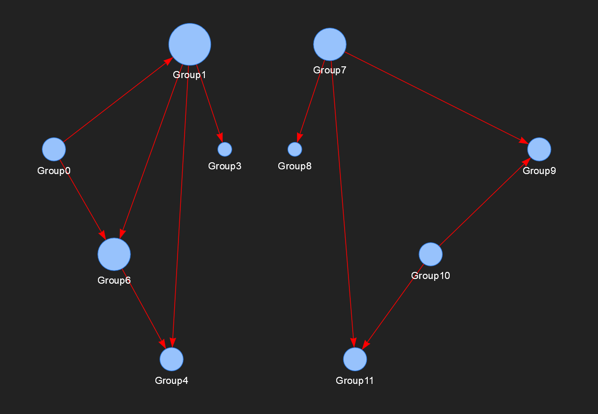

# Graph Visualizer

This is a (very) small python script that takes data from a csv and displays a corresponding graph (see example). I uses the [pyvis](https://pyvis.readthedocs.io/en/latest/index.html) librabry
The script can be used for e.g. analysing group memberships in an AD.

## Example
Heres an example with the visualization of groups and group-membership. The source data (csv) looks as follows:

```code
Group,MemberOfGroup
Group0,Group1
Group1,Group3
Group1,Group4
Group1,Group6
Group0,Group6
Group6,Group4
Group7,Group8
Group7,Group9
Group7,Group11
Group10,Group11
Group10,Group9
```

The resulting output (HTML-file):



This example can be reproduced using the example data in the folder ./exampledata/ and following command:

```code
$> GraphVisualizer.py -d ./exampledata/groups.csv -C
```

## Usage

```code
usage: GraphVisualizer.exe [-h] [-V] [-d DATA] [-o OUT] [-n NAME] [-C] [-S]

optional arguments:
  -h, --help            show this help message and exit
  -V, -v, --version     show program version
  -d DATA, --data DATA  CSV containing data
  -o OUT, --out OUT     Output path (DEFAULT: ./)
  -n NAME, --name NAME  Name of the plot
  -C, -c, --csvheader   FLAG: First line in CSV file contains header
  -S, -s, --settings    FLAG: Display settings in HTML file
```
